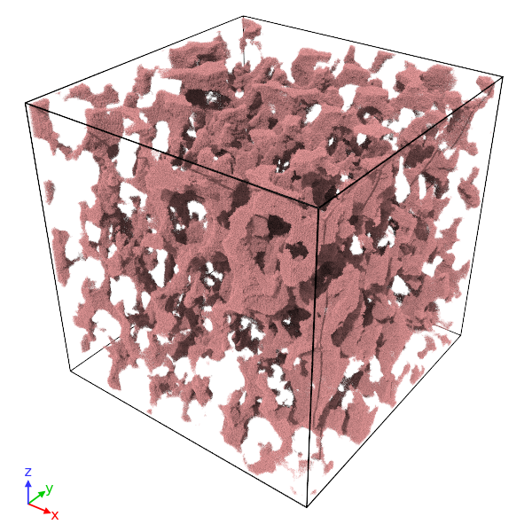
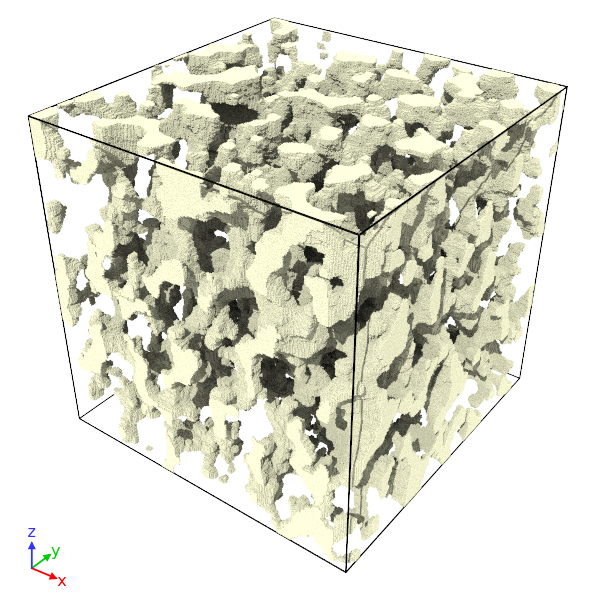
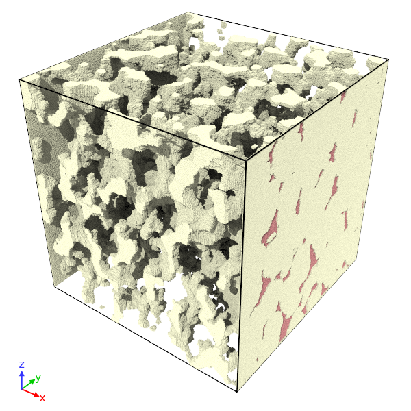
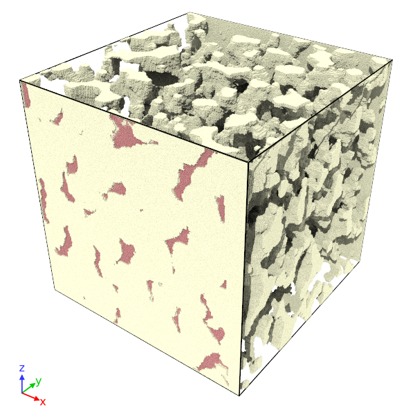
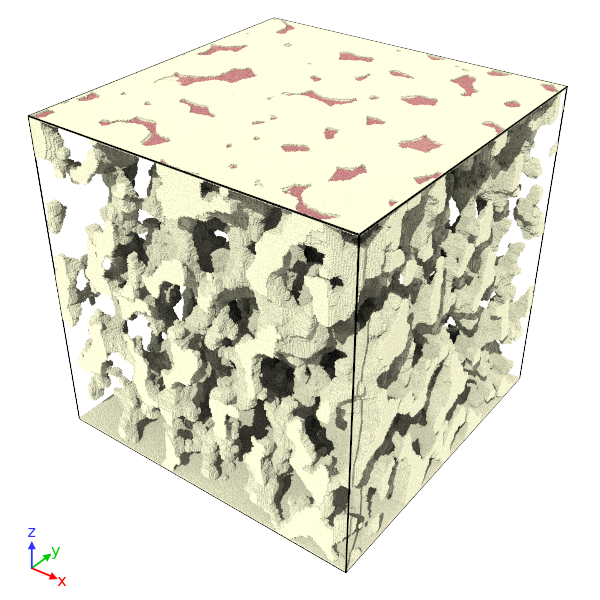

# VOX2DPD

Author: Yidong Xia, Ph.D.

Visit [Google Scholar site](https://scholar.google.com/citations?user=NlZn1iEAAAAJ&hl=en&oi=ao)

Visit [ResearchGate site](https://www.researchgate.net/profile/Yidong_Xia)

## Overview

**VOX2DPD** (voxels to dissipative particle dyanmics) is a C++ code that converts voxel data of connected pore networks to LAMMPS formate data for DPD pore network flow simulations.

Please cite the following article if you use this code.

Xia, Y., Goral, J., Huang, H., Miskovic, I., Meakin, P. and Deo, M., 2017. Many-body dissipative particle dynamics modeling of fluid flow in fine-grained nanoporous shales. *Physics of Fluids*, 29(5), p.056601.

## User's Guide

### Control script

Example:

A line that starts from # is comment

	# flow direction (0 = default;1 = x; 2 = y; 3 = z)
	1
	# cropXlo cropXhi (in %) ... range of cropped block in x-direction
	41      82
	# cropYlo cropYhi (in %) ... range of cropped block in y-direction
	18      82
	# cropZLo cropZHi (in %) ... range of cropped block in z-direction
	32      64
	# hx hy hz (scaling coefficient in each direction)
	1  1  1
	# nSolidsPerLattice nFluidsPerLattice (0 = packing by delete from full box)
	0                 0
	# nTypes (default = 3)
	3
	# outSolid? outFluid? (whether to save solid/fluid particle data)
	1         1

## Examples

A block of nano-porous synthetic silica with voxel resolution of 7.7 nanometer.

* We choose the packing mode as "delete from the full box" (nSolidsPerLattice = nFluidsPerLattice = 0).
 
* Visualization of the pore skeleton in the cropped block region.

* Pore surface wall in the case of (flow direction = 0). The pore channels at the block's boundaries are sealed with solid particles, because we do not expect the fluid in the pores to flow outside the pores. 

* Pore surface wall in the case of (flow direction = 1). Two thin solid wall panesl are added to the block's boundaries in the x-direction, with the pore channels at the two ends open. At the other directions, the pore channels are sealed with solid particles at the ends.ends. So the fluid in the pores is allowed to flow through the x-direction of the pore system.

* Pore surface wall in the case of (flow direction = 2). Two thin solid wall panesl are added to the block's boundaries in the y-direction, with the pore channels at the two ends open. At the other directions, the pore channels are sealed with solid particles at the ends.ends. So the fluid in the pores is allowed to flow through the y-direction of the pore system.

* Pore surface wall in the case of (flow direction = 3). Two thin solid wall panesl are added to the block's boundaries in the z-direction, with the pore channels at the two ends open. At the other directions, the pore channels are sealed with solid particles at the ends.ends. So the fluid in the pores is allowed to flow through the z-direction of the pore system.

## Limitation

To be added ...

